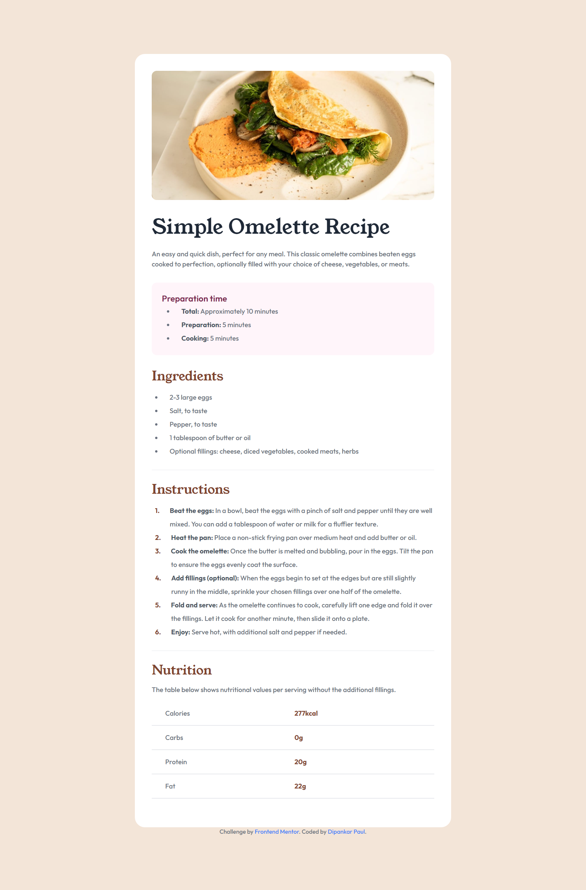
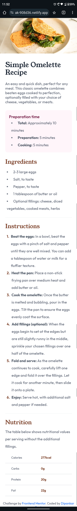

<!-- omit in toc -->
# Frontend Mentor - Recipe page solution

This is a solution to the [Recipe page challenge on Frontend Mentor](https://www.frontendmentor.io/challenges/recipe-page-KiTsR8QQKm). Frontend Mentor challenges help you improve your coding skills by building realistic projects. 

<!-- omit in toc -->
## Table of contents

- [Overview](#overview)
  - [Screenshot](#screenshot)
  - [Links](#links)
- [My process](#my-process)
  - [Built with](#built-with)
  - [What I learned](#what-i-learned)
  - [Continued development](#continued-development)
- [Author](#author)

## Overview

### Screenshot

Desktop view

  

Mobile view

  

### Links

- [Solution URL](https://www.frontendmentor.io/solutions/responsive-recipe-page-with-tailwind-css-zOw4BLQBhT)
- [Live Site URL](https://deft-paprenjak-908d36.netlify.app/)

## My process

### Built with

- Semantic HTML5 markup
- Tailwind css

### What I learned

This is my second project with tailwind css and i learned a lot. Mainly i learned about responsive designs.

### Continued development

I will continue to make more side projects with tailwind css until I can build any type of landing pages with tailwind css.

## Author

- Frontend Mentor - [@dipankarpaul2k](https://www.frontendmentor.io/profile/dipankarpaul2k)
